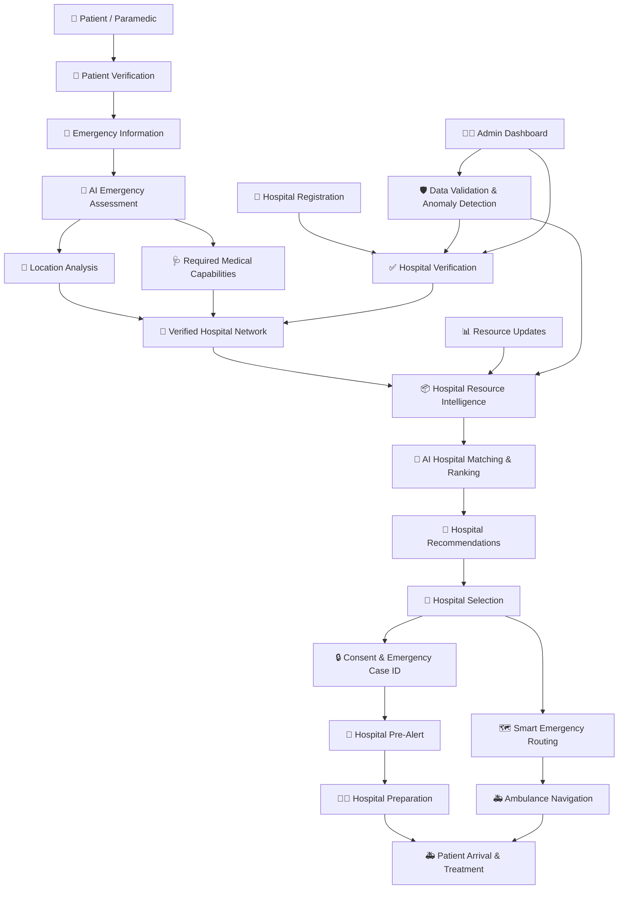

## 🏗️ System Architecture

PRAANJEEV follows an AI-powered emergency coordination architecture that connects **patients, ambulances, verified hospitals, hospital resources, and administrators** into one coordinated workflow.

### 🔄 Architecture Overview



### 🧩 Architecture Components

| Component                              | Responsibility                                                                           |
| -------------------------------------- | ---------------------------------------------------------------------------------------- |
| 👤 **Patient / Paramedic Interface**   | Enter emergency information, verify patient and provide location                         |
| 🤖 **AI Emergency Assessment**         | Understand emergency information and determine urgency as decision support               |
| 📍 **Location Intelligence**           | Identify hospitals relevant to the patient's current location                            |
| 🏥 **Verified Hospital Network**       | Provides hospitals that have completed the verification process                          |
| 📦 **Hospital Resource Intelligence**  | Tracks ICU beds, emergency beds, oxygen, medicines, blood, specialists and equipment     |
| 🤖 **AI Hospital Matching Engine**     | Ranks hospitals using condition, capabilities, resources, verification, distance and ETA |
| 🗺️ **Smart Routing Engine**           | Provides traffic-aware emergency routes and supports dynamic rerouting                   |
| 🔒 **Consent & Emergency Case System** | Manages consent and generates a unique Emergency Case ID                                 |
| 📨 **Hospital Pre-Alert**              | Sends essential emergency information to the selected hospital before arrival            |
| 👨‍⚕️ **Hospital Dashboard**           | Allows hospitals to view emergency cases and prepare required resources                  |
| 👨‍💼 **Admin Dashboard**              | Handles hospital verification, monitoring and suspicious-data management                 |
| 🛡️ **Data Validation Engine**         | Detects inconsistent, duplicate, impossible or suspicious information                    |

### 🔄 Data Flow

```text
Emergency Input
       ↓
AI Emergency Assessment
       ↓
Location + Medical Requirement Analysis
       ↓
Verified Hospital Search
       ↓
Hospital Resource Analysis
       ↓
AI Hospital Matching & Ranking
       ↓
Hospital Recommendation
       ↓
Patient / Paramedic Selection
       ↓
Consent + Emergency Case ID
       ↓
Hospital Pre-Alert
       ↓
Smart Emergency Route
       ↓
Hospital Preparation
       ↓
Patient Arrival
       ↓
Emergency Treatment
```

### 🧠 AI Hospital Matching

PRAANJEEV does not simply select the nearest hospital.

The AI evaluates multiple factors:

```text
Patient Condition
        +
Required Medical Capabilities
        +
Hospital Resource Availability
        +
Hospital Verification Status
        +
Distance
        +
Traffic / ETA
        ↓
AI Hospital Ranking
        ↓
Best-Matched Hospital
```

For example, a hospital that is slightly farther away may receive a higher ranking if it has the required **ICU, oxygen and emergency/cardiac capabilities**.

### 🏥 Hospital Verification

Before a hospital becomes part of the trusted network, PRAANJEEV can verify:

* Hospital registration details
* Required legal/licensing documents
* Authorized representative
* Medical capabilities
* Hospital information
* Verification status

```text
Registration
     ↓
Document Verification
     ↓
Admin Review
     ↓
Verified Hospital
     ↓
Periodic Re-verification
```

### 📦 Hospital Resource Intelligence

Hospital resource information can include:

* ICU beds
* Emergency beds
* Oxygen availability
* Critical medicines
* Blood availability
* Specialists
* Emergency facilities
* Medical equipment

Each resource can include a **last-updated timestamp** so that outdated information can be identified.

### 📨 Hospital Pre-Alert

After the patient/paramedic selects a hospital and provides consent, PRAANJEEV generates an **Emergency Case ID** and sends the minimum necessary emergency information to the selected hospital.

Example:

```text
Emergency Case: PJ-2026-00124
Severity: CRITICAL
ETA: 11 minutes

Required:
✓ ICU
✓ Oxygen
✓ Emergency/Cardiac Capability

Status:
🚑 En Route
```

This allows the hospital to begin preparing **before the patient arrives**.

### 🗺️ Smart Emergency Routing

The routing layer considers:

* Current location
* Hospital location
* Distance
* Traffic
* Estimated arrival time
* Alternate routes

If traffic conditions change, the system can support route updates through the connected routing service.

### 🛡️ Security & Responsible AI

PRAANJEEV follows a responsible-AI approach:

* Patient consent before information sharing
* Minimum necessary emergency information
* Hospital verification
* Suspicious-data detection
* Auditability of important actions
* Clear resource-update timestamps
* AI recommendations are explainable
* AI is used for **decision support, not medical diagnosis**
* Demonstration/simulated hospital data is clearly identified

### ⭐ Core Architecture Principle

> **INPUT → UNDERSTAND → MATCH → DECIDE → COORDINATE → ROUTE → PREPARE → RESPOND**

### ❤️ PRAANJEEV USP

> **“PRAANJEEV doesn't just find the nearest hospital. It helps find the RIGHT VERIFIED hospital, securely shares the RIGHT emergency information, and gives the hospital time to prepare BEFORE the patient arrives.”**
